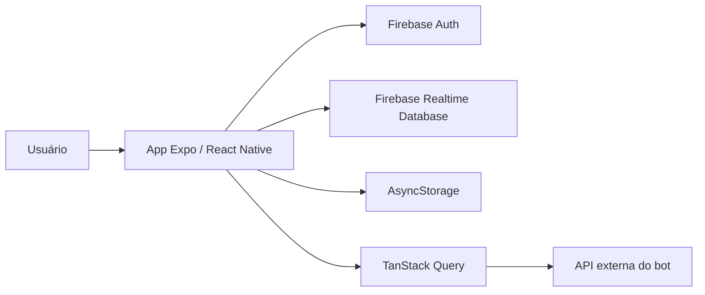

<div align="center">
  

# OmniZap

**Aplicativo mobile para gerenciar lembretes e acompanhar a operação de um bot integrado ao WhatsApp.**


</div>

## Visão geral

O OmniZap centraliza autenticação, perfil, indicadores e lembretes associados ao número de WhatsApp do usuário. O aplicativo usa Firebase para identidade e dados do perfil, enquanto uma API HTTP externa fornece o dashboard e as operações de lembretes.

### Funcionalidades

- Cadastro e login com e-mail e senha.
- Onboarding com nome e número de WhatsApp.
- Sessão persistente com Firebase Auth e AsyncStorage.
- Dashboard com totais de atendimentos e lembretes.
- Listagem e atualização automática de lembretes.
- Criação de lembretes com horários rápidos.
- Visualização e exclusão de lembretes.
- Edição do nome do perfil e encerramento da sessão.
- Interface responsiva com navegação protegida e feedback por toast.

## Tecnologias

- [Expo](https://expo.dev/) e [React Native](https://reactnative.dev/)
- [Expo Router](https://docs.expo.dev/router/introduction/)
- [TypeScript](https://www.typescriptlang.org/)
- [Firebase Authentication](https://firebase.google.com/docs/auth) e [Realtime Database](https://firebase.google.com/docs/database)
- [TanStack Query](https://tanstack.com/query/latest) para cache e sincronização
- [Axios](https://axios-http.com/) para acesso à API
- [NativeWind](https://www.nativewind.dev/) e Tailwind CSS
- React Hook Form, AsyncStorage e React Native Safe Area Context

## Arquitetura



- O Firebase Auth controla cadastro, login e sessão.
- O Realtime Database mantém nome e telefone em `users/{uid}/name`.
- O telefone também é armazenado localmente para reduzir leituras repetidas.
- A API externa gerencia dashboard e lembretes.

## Pré-requisitos

- [Node.js](https://nodejs.org/) 20 LTS ou superior
- npm
- Um projeto no Firebase com Authentication e Realtime Database
- Backend compatível com os endpoints usados pelo aplicativo
- Expo Go ou ambiente nativo Android/iOS

## Configuração

1. Instale as dependências:

   ```bash
   npm install
   ```

2. Crie um arquivo `.env` na raiz:

   ```env
   EXPO_PUBLIC_FIREBASE_API_KEY=
   EXPO_PUBLIC_FIREBASE_AUTH_DOMAIN=
   EXPO_PUBLIC_FIREBASE_DATABASE_URL=
   EXPO_PUBLIC_FIREBASE_PROJECT_ID=
   EXPO_PUBLIC_FIREBASE_STORAGE_BUCKET=
   EXPO_PUBLIC_FIREBASE_MESSAGING_SENDER_ID=
   EXPO_PUBLIC_FIREBASE_APP_ID=
   EXPO_PUBLIC_FIREBASE_MEASUREMENT_ID=
   ```

3. No Firebase Console:
   - habilite o provedor **E-mail/senha** em Authentication;
   - crie o Realtime Database;
   - copie as credenciais do aplicativo Web para o `.env`.

> [!IMPORTANT]
> Variáveis com `EXPO_PUBLIC_` são incluídas no bundle do aplicativo. Não coloque chaves privadas ou credenciais administrativas nelas.

4. Configure a URL do backend em [`src/services/api.ts`](./src/services/api.ts).

> [!NOTE]
> O endereço configurado atualmente usa um túnel ngrok e pode expirar. Substitua-o pela URL ativa da API antes de executar os fluxos de dashboard e lembretes.

## Executando

Inicie o servidor de desenvolvimento:

```bash
npm start
```

Outros comandos disponíveis:

| Comando            | Descrição                                  |
| ------------------ | ------------------------------------------ |
| `npm run android`  | Compila e executa o projeto Android nativo |
| `npm run ios`      | Compila e executa o projeto iOS nativo     |
| `npm run web`      | Executa a versão web                       |
| `npm run prebuild` | Gera os projetos nativos do Expo           |
| `npm run lint`     | Verifica ESLint e Prettier                 |
| `npm run format`   | Aplica correções de lint e formatação      |

## API esperada

O aplicativo envia o telefone do usuário como identificador da operação.

| Método   | Endpoint                         | Uso                                       |
| -------- | -------------------------------- | ----------------------------------------- |
| `GET`    | `/dashboard?numero=...`          | Retorna totais de comandos e atendimentos |
| `GET`    | `/api/lembretes?numero=...`      | Lista os lembretes                        |
| `POST`   | `/api/lembrete`                  | Cria um lembrete                          |
| `DELETE` | `/api/lembretes/{id}?numero=...` | Remove um lembrete                        |

Exemplo de criação:

```json
{
  "numero": "5521999999999",
  "mensagem": "lembrar 18:00 beber agua"
}
```

## Estrutura do projeto

```text
app/
├── (auth)/           # Login e cadastro
├── (tabs)/           # Home e perfil
├── _layout.tsx       # Providers e navegação principal
├── criar-comando.tsx # Criação de lembretes
└── onboarding.tsx    # Nome e telefone do usuário
src/
├── components/       # Componentes da interface
├── config/           # Inicialização do Firebase
├── hooks/            # Consultas do dashboard
├── modais/           # Modais de ações e perfil
├── services/         # Cliente HTTP
└── utils/            # Recuperação do telefone
assets/               # Logo, ícones, splash e fontes
```

## Solução de problemas

**`process` não é reconhecido pelo TypeScript**

Confirme que [`expo-env.d.ts`](./expo-env.d.ts) existe e reinicie o servidor TypeScript do editor.

**Dashboard ou lembretes não carregam**

Verifique se a API está online, se a URL em `src/services/api.ts` está atualizada e se o telefone foi salvo durante o onboarding.

**Falha no login ou cadastro**

Confirme as variáveis do Firebase, o provedor E-mail/senha e as regras do Realtime Database.
