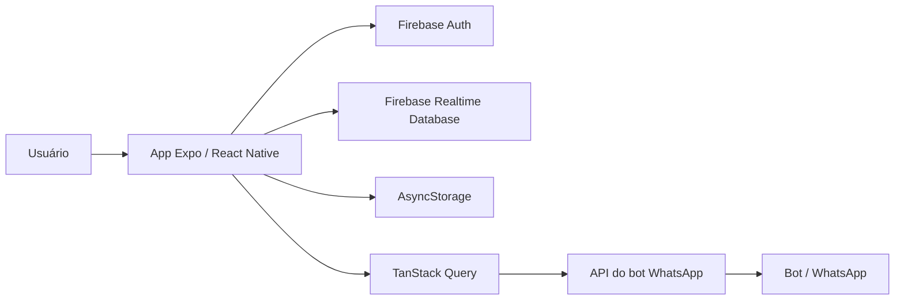

<div align="center">
  

# OmniZap

Aplicativo mobile para criar, acompanhar e confirmar lembretes enviados pelo WhatsApp.


</div>

## Visão Geral

OmniZap é um app Expo/React Native que conecta uma conta Firebase a uma API de bot para WhatsApp. O usuário cria lembretes pontuais ou recorrentes, acompanha indicadores da operação, confirma pendências vindas do bot e recebe feedback visual quando a conexão com o backend está indisponível.

## Funcionalidades

- Autenticação com e-mail/senha, criação de conta e recuperação de senha.
- Onboarding com nome e número de WhatsApp do usuário.
- Persistência de sessão e telefone com Firebase Auth, Realtime Database e AsyncStorage.
- Dashboard com totais de lembretes e avisos enviados pelo WhatsApp.
- Listagem de lembretes com filtros por dia, pontuais e recorrentes.
- Criação de lembretes pontuais, diários e semanais.
- Edição e exclusão de lembretes com atualização otimista no cache.
- Confirmação ou cancelamento de pendências geradas pelo bot.
- Health check do backend com banner de alerta quando o bot está offline.
- Interface mobile com Expo Router, NativeWind, TanStack Query e feedback por toast.

## Tech Stack

- [Expo](https://expo.dev/) 54 e [React Native](https://reactnative.dev/) 0.81
- [Expo Router](https://docs.expo.dev/router/introduction/) para navegação
- [TypeScript](https://www.typescriptlang.org/)
- [Firebase Authentication](https://firebase.google.com/docs/auth) e [Realtime Database](https://firebase.google.com/docs/database)
- [TanStack Query](https://tanstack.com/query/latest) para cache, polling e invalidação
- [Axios](https://axios-http.com/) para chamadas HTTP
- [NativeWind](https://www.nativewind.dev/) e Tailwind CSS
- React Hook Form, AsyncStorage, React Native SVG, Lucide e Expo Vector Icons

## Arquitetura



- Firebase Auth controla cadastro, login, recuperação de senha e sessão.
- Realtime Database salva os dados de perfil em `users/{uid}/name`.
- AsyncStorage guarda `user_phone` para evitar leituras repetidas do telefone.
- TanStack Query sincroniza dashboard, lembretes, pendências e health check.
- A API externa é responsável por dashboard, lembretes, pendências e status do bot.

## Pré-Requisitos

- [Node.js](https://nodejs.org/) 20 LTS ou superior
- npm
- Projeto Firebase com Authentication e Realtime Database habilitados
- Backend compatível com os endpoints usados pelo app
- Expo Go ou ambiente nativo Android/iOS configurado

## Começando

Instale as dependências:

```bash
npm install
```

Crie um arquivo `.env` na raiz do projeto:

```env
EXPO_PUBLIC_FIREBASE_API_KEY=
EXPO_PUBLIC_FIREBASE_AUTH_DOMAIN=
EXPO_PUBLIC_FIREBASE_DATABASE_URL=
EXPO_PUBLIC_FIREBASE_PROJECT_ID=
EXPO_PUBLIC_FIREBASE_STORAGE_BUCKET=
EXPO_PUBLIC_FIREBASE_MESSAGING_SENDER_ID=
EXPO_PUBLIC_FIREBASE_APP_ID=
EXPO_PUBLIC_FIREBASE_MEASUREMENT_ID=
```

No Firebase Console:

1. habilite o provedor Email/senha em Authentication;
2. crie ou configure o Realtime Database;
3. copie as credenciais do aplicativo Web para o `.env`.

> [!IMPORTANT]
> Variáveis `EXPO_PUBLIC_*` são incluídas no bundle do app. Não coloque chaves privadas, tokens administrativos ou segredos de backend nelas.

Configure a URL da API em [`src/services/api.ts`](./src/services/api.ts):

```ts
export const api = axios.create({
  baseURL: 'https://sua-api.example.com',
});
```

> [!NOTE]
> A URL versionada atualmente usa um túnel ngrok. Esse tipo de endereço pode expirar, então substitua pelo backend ativo antes de testar dashboard, lembretes e pendências.

## Executando

Inicie o servidor de desenvolvimento:

```bash
npm start
```

Comandos disponíveis:

| Command | Description |
| --- | --- |
| `npm start` | Inicia o Expo Dev Server |
| `npm run android` | Compila e executa no Android |
| `npm run ios` | Compila e executa no iOS |
| `npm run web` | Executa a versão web |
| `npm run prebuild` | Gera os projetos nativos do Expo |
| `npm run lint` | Verifica ESLint e Prettier |
| `npm run format` | Corrige lint e formatação |

## Contrato da API

O app usa o telefone do usuário (`numero`) como identificador principal das operações do bot.

| Method | Endpoint | Purpose |
| --- | --- | --- |
| `GET` | `/health` | Verifica se o backend do bot está online |
| `GET` | `/dashboard?numero=...` | Retorna totais do dashboard |
| `GET` | `/api/lembretes?numero=...` | Lista lembretes |
| `POST` | `/api/lembrete` | Cria um lembrete |
| `PUT` | `/api/lembretes/{id}` | Atualiza um lembrete |
| `DELETE` | `/api/lembretes/{id}?numero=...` | Remove um lembrete |
| `GET` | `/api/pendencias?numero=...` | Lista pendências de confirmação |
| `POST` | `/api/pendencias/{id}/confirmar` | Confirma uma pendência |
| `POST` | `/api/pendencias/{id}/cancelar` | Cancela uma pendência |

Exemplo de payload para criar ou atualizar lembrete:

```json
{
  "numero": "5521999999999",
  "type": "once",
  "date": "2026-06-17",
  "time": "18:00",
  "message": "beber agua"
}
```

Tipos de recorrência suportados pelo app:

| Type | Fields |
| --- | --- |
| `once` | `date`, `time`, `message` |
| `daily` | `time`, `message` |
| `weekly` | `weekday`, `time`, `message` |

## Estrutura do Projeto

```text
app/
  (auth)/              Login, cadastro e recuperação de senha
  (tabs)/              Home e perfil
  _layout.tsx          Providers globais e navegação principal
  criar-comando.tsx    Criação de lembretes
  onboarding.tsx       Nome e WhatsApp do usuário
src/
  components/          Componentes reutilizáveis da interface
  config/              Inicialização do Firebase
  hooks/               Hooks de dashboard, pendências e health check
  modais/              Modais de perfil e ações de lembrete
  services/            Cliente HTTP, cache e regras de lembrete
  utils/               Utilitários de dados do usuário
assets/                Logo, ícones, splash e fontes
docs/                  Notas e planos técnicos do projeto
```

## Solução de Problemas

**Dashboard, lembretes ou pendências não carregam**

Verifique se a API está online, se `baseURL` em `src/services/api.ts` aponta para o backend correto e se o telefone foi salvo no onboarding.

**Bot aparece como offline**

Confirme se `GET /health` responde em menos de 5 segundos e retorna um status HTTP `2xx`.

**Login ou cadastro falha**

Confira as variáveis do Firebase, o provedor Email/senha e as regras do Realtime Database.

**Mudanças visuais não aparecem**

Reinicie o Expo com cache limpo:

```bash
npx expo start --clear
```
